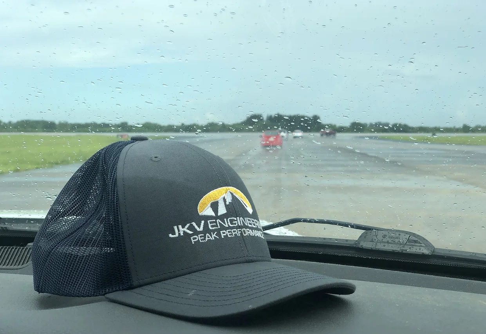
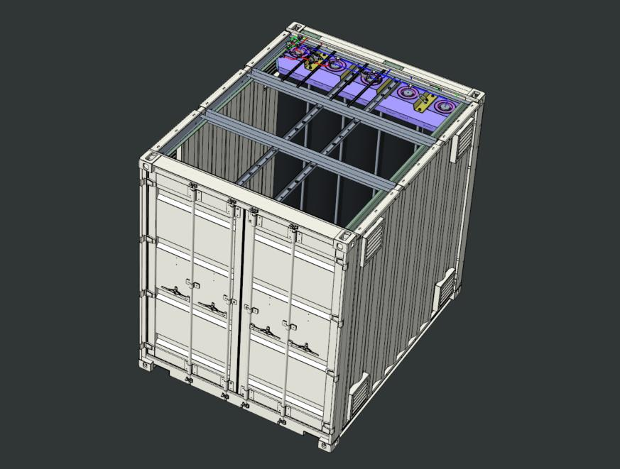
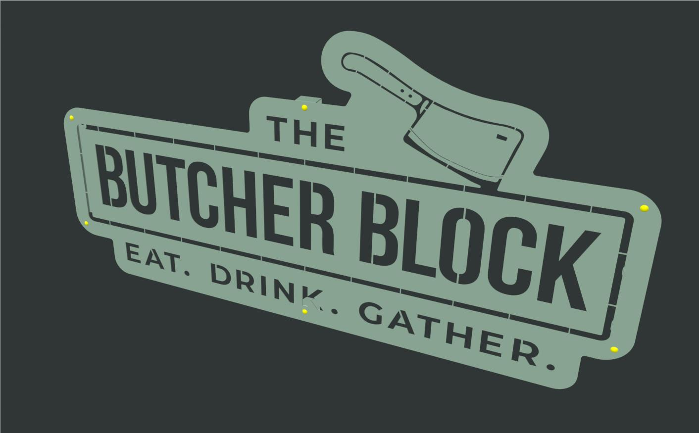
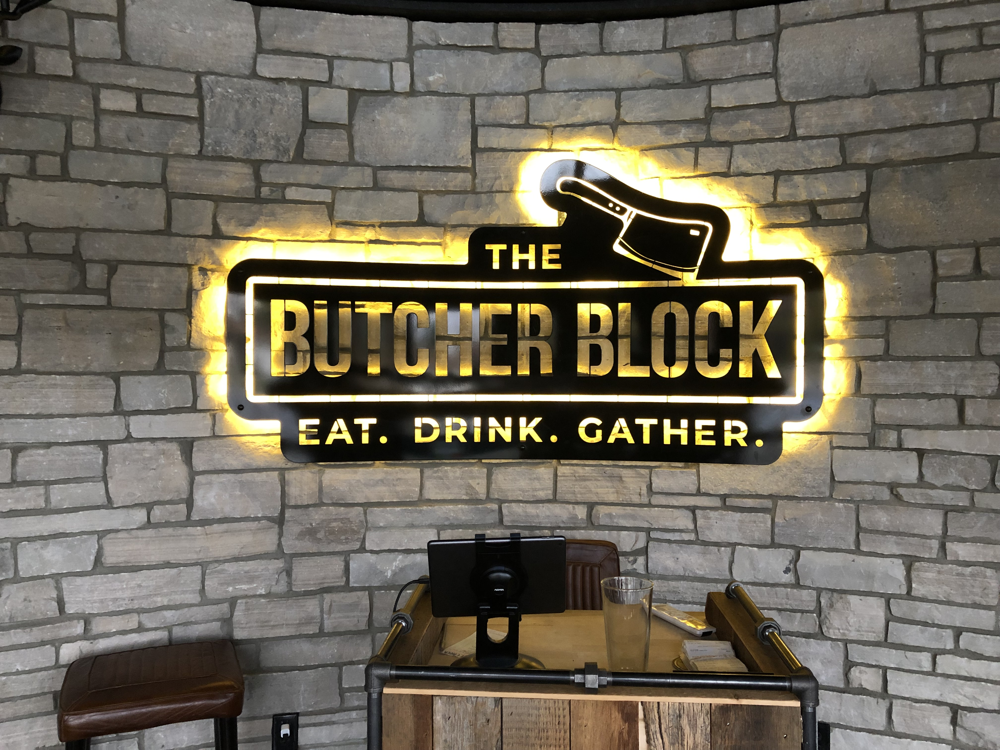
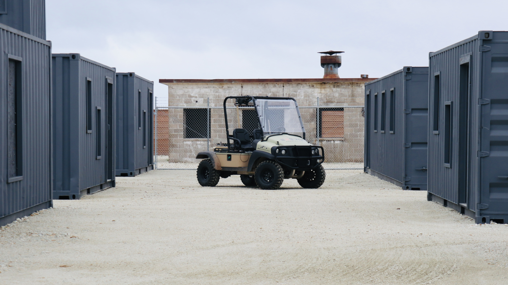

---
---

JKV Engineering is a small group of passionate engineers based in Milford Ohio, just outside of Cincinnati. Whether you are looking for a full-service engineering contractor or just need help with a subset of your project, we will deliver great results for you. No matter how complicated or simple the project, we love seeing the job done well and done right.

# What We Offer 

<h2 id="engineering-services">Engineering Services</h2>

...where our experience base enhances your engineering team.  In these type of engagements we support our customer’s development from concept selection through design for manufacturing.  Our activities as an engineering service provider include development of concept selection matrices, 3D CAD modeling, CAE (simulation and mathematical modeling), DFMEA, BOMs, Drawing packages, test plans/physical testing, and more.  We’ve worked with clients around the US and globally, on multiple year engineering programs.      

<h2 id="design-services">Design Services</h2>

Turn your business logo into physical signs. Our team can work with graphic design, then convert it into fabrication-ready engineering design (CAD) that includes mounting, lighting, and more. Finally, we will fabricate the sign and deliver to your business.

Of course, we are not limited to storefront signs. We have made beer tap handles and other decorative pieces for business establishments.

<h2 id="systems-engineering">Systems Engineering</h2>

JKV has offered full systems engineering under one roof since it was started.  This means physical equipment with sensors, and feedback motion control.  We gained this expertise through developing control systems for vehicle applications including: powertrain control, engine control, thermal management system control, HVAC, and more.  We save our customers time and money by helping to design the physical system and then the electrical design, sensor package, control loops, and HMIs.    We can develop control systems on embedded microprocessors or PLCs.

<h2 id="rapid-engineered-prototypes">Rapid, Engineered, Prototypes</h2>

...for companies developing new products.   Our unique advantage is that we produce high quality designs, bills of materials, CAD models, and drawings in the same building where we have significant manufacturing capability.  At the end of a project we deliver a well organized engineering package along with a very high quality, functional prototype.  Often these first articles along with the engineering package are extremely useful to help our customers quickly bring new products to market.

<h2 id="fabrication-services">Fabrication Services</h2>

...have always been a key component of what we do.  We’ve fabricated everything from industrial equipment to mobile equipment (cars and trucks) to architectural installations and more.

_Our Engineering and Fabrication facility has the following capabilities:_

- CNC Waterjet cutting on our Flow Mach IV (5'x8' capacity) - Steel, Stainless Steel, Aluminum, Plastics, Composites, Stone, etc.
- CNC machining on 2 routers (wood, plastic, composites, and aluminum)
- CNC Press-Brake Sheetmetal Bending (up to 10' length and 1/2" thickness)!
- CNC Tube Bending (0.5" to 2.0" steel tubing up to schedule 40 wall thickness)
- Welding (TIG, AC/DC-Pulse MIG, Stick)