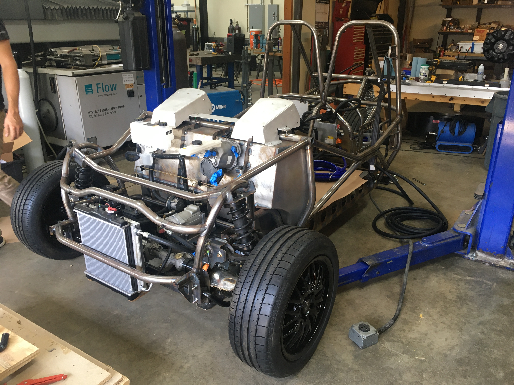
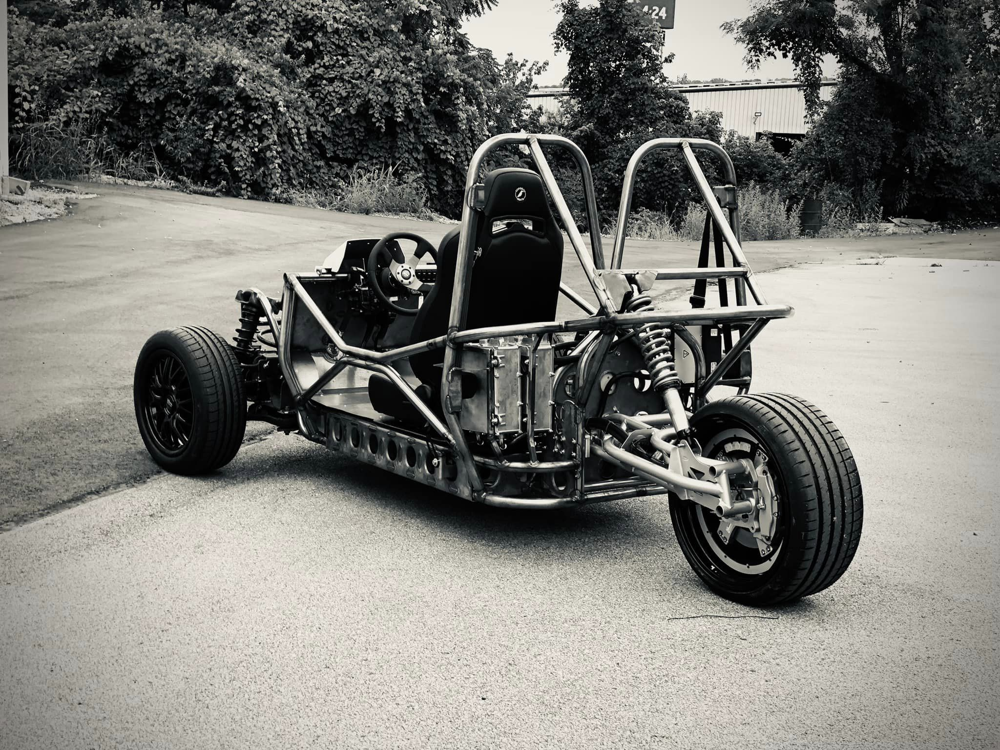
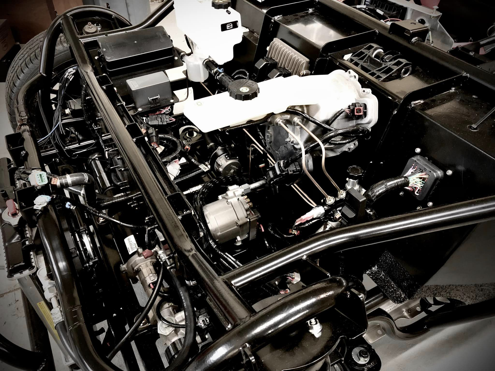
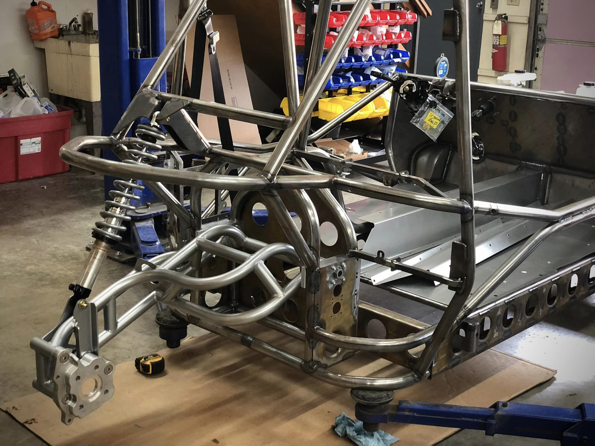

Other than driving it, there's no better way to showcase this project than to show a video.

  <iframe width="560" height="315" src="https://www.youtube.com/embed/6x-7uzNh7uU?si=0cRQ1aQKH03IssXI" title="YouTube video player" frameborder="0" allow="accelerometer; autoplay; clipboard-write; encrypted-media; gyroscope; picture-in-picture; web-share" allowfullscreen></iframe>
  The electric three-wheeler in action

# Project Idea

[GreenStreet EV Inc](https://greenstreetautocycles.com/) is a company with an aim to mass produce electric three-wheelers. With the company being a startup with only a small engineering team, they needed help to bring their idea to life.

JKV was tasked with designing, and building, the first proof-of-concept prototype of the vehicle. We had our hands in every step of the process, from benchmarking, developing the design concepts, to fabrication, while communicating and collaborating closely with our client.

# Outcome

With it being very light and having such a low center of gravity, this three-wheeler is a joy to drive around! 

The prototype phase of the project is successfully completed, and I think we are just excited about the outcome as the Greenstreet people are. 

# What's Next?

Greenstreet is currently hard at work in turning the concept in to a mass-production-intent design. You can learn about the latest status on their website, which you will find the link below.

Do you have a product idea for a cool vehicle but don't have the engineering team to make it a reality? If so, get in touch with us. We have the team to be able to fully design a vehicle, electric or otherwise.

# Learn More

* [Greenstreet Official Website](https://greenstreetautocycles.com/)

 

Did this article inspire a project idea of your own? We would love to work on it together. Please [contact us](/contact)!