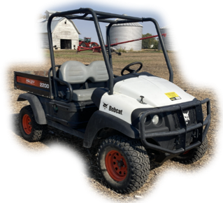
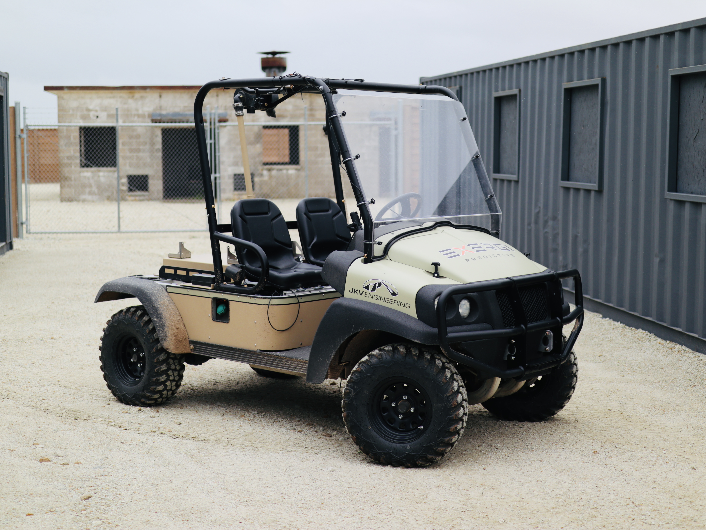
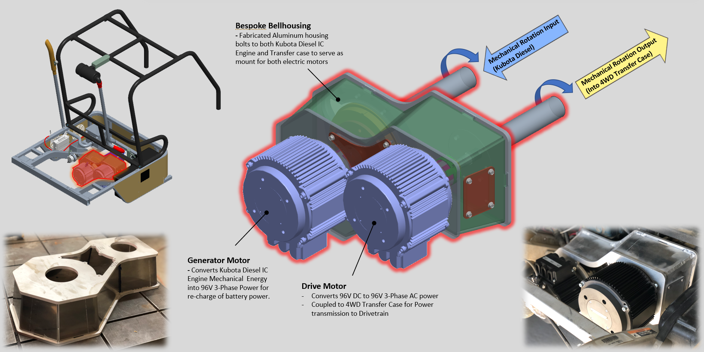

# Project Idea

Our client, [Exergi Predictive](https://www.exergipredictive.com/), predictive software solutions for energy management of military vehicles.  They were looking to showcase their solutions to the United States Department of Defense and needed help with prototyping a solution.

They approached us to help build the vehicle platform, which would be used to demonstrate their software to the DoD.

# Concept

Based on what we learned through benchmarking, we selected a Light Off-Highway Vehicle (Bobcat 2200) as the base vehicle. The vehicle was to be primarily driven by a 15kW Electric Motor. The diesel engine, which came originally with the Bobcat, would be utilized as an on-board generator to recharge the battery and provide extended range.

# Outcome

JKV successfully engineered and built the vehicle, which was demonstrated to military personnel at the Texas A&M campus in June of 2023. 

Some of the key tasks in the build include:

* Conversion to the electric drive system, which includes a bespoke charging and power transmission setup that utilizes the original diesel engine of the Bobcat 2200.

* Designing and building of the electronics - battery module, battery management, vehicle control unit (VCU), etc.

* Programming of the vehicle, powertrain, and battery control system, designed to communicate with the client's software. 

* Added sensors throughout the vehicle to gather requested data for the client. (wheel speed, manifold pressure, intake air temperature, etc.)

* Dash display and driver interface.

# What's Next?

We are supporting demos of the vehicle's technologies as requested by our client, such as the GVSETS in Detroit back in August of 2023. 

We also wonder if this type of a vehicle could find interest in the civilian industry as well (farms or recreational?).

# Learn More

* [How Collaboration Within Private Industry is Driving DoD Innovation (By Volcon)](https://exergipredictive.com/the-intersection-of-technology-and-military-modernization/)
* [Exergi Predictive partners with JKV Engineering at GVSETS in Detroit! (By Exergi)](https://exergipredictive.com/exergi-predictive-parnters-with-jkv-engineering-at-gvsets-in-detroit/)

 

Did this article inspire a project idea of your own? We would love to work on it together. Please [contact us](/contact)!