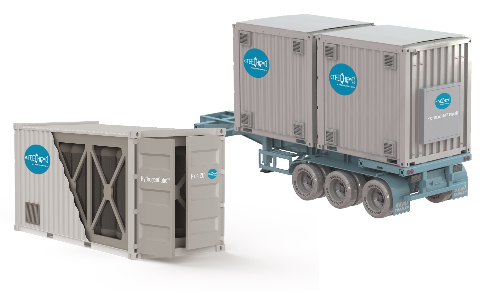

# Project Idea

[Steelhead Composites](https://steelheadcomposites.com/hydrogen-storage/), based in Wheat Ridge, Colorado, develops and manufactures Composite Overwrapped Pressure Vessels (COPVs) of wide-ranging sizes for storing hydrogen and other gases. They had an idea to build a hydrogen storage system based on an ISO shipping container, but needed a partner who can design and build such a system...

# Collaboration

JKV's system design and fabrication capabilities were a great fit to Steelhead's expertise and knowhow in pressure vessels. With guidance from Steelhead, JKV designed the structure and the plumbing to house over 8,000L of hydrogen gas at 5,000psi within a 10ft by 8ft footprint, complete with pressure relief devices (PRDs) that will safely discharge the contents in case of fire. 

# Outcome

The design process started sometime in the Spring of 2022. And in April of 2023, JKV successfully built and delivered the first example of the system.

Along the way, we learned so much about how to...

* Safely handle these large vessels, and how to design the structure to enable us to do so
* Design the plumbing system for ease of assembly, and how to properly assemble 
* Test the system to ensure that the system is completely leak-proof

# What's Next?

Having this system DOT-certified so that it can travel on the road filled with hydrogen, is a step that we are already undertaking. 

We know that Steelhead is seeing tremendous demand for systems like this. There are variations of the design, in terms of vessel size, container size, use-cases, etc., so we are very much looking forward to continue to collaborate.

In one ongoing project, we are assisting Steelhead with a PLC system design that will manage the electrical controls as well as collect valuable data.

We think this energy storage/distribution industry has so much potential in the immediate future. If you have a project idea in this space, let us know! We'd be very excited to help make your idea a reality.

# Learn More

* [Steelhead Composites](https://steelheadcomposites.com/)

 

Did this article inspire a project idea of your own? We would love to work on it together. Please [contact us](/contact)!