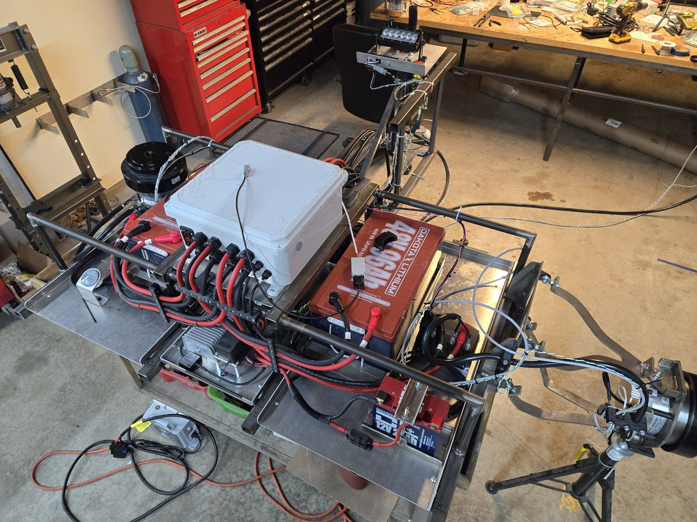

We may be a small company, but we are not afraid to take on some seriously big ideas! 

As far as dream projects for an engineer goes, it would be tough to top "working on a lunar rover". But that's exactly what JKV had the opportunity and the honor to do.

# The Project

Our customer was selected to design and build a lunar rover demonstrator for [NASA's Artemis project](https://www.nasa.gov/feature/artemis/), which plans to send astronauts to the moon in 2026. 

For such a massive and critical undertaking they understandably were seeking some help to ensure they can deliver a great result. Due to our extensive knowledge and experience in electric drive systems (See examples here, here, and here), JKV was chosen to deliver a fully functional set of electronics and software for the rover's drive system. 

Features of the drive system included:

* All-wheel drive, in-wheel electric motor for propulsion
* Fully powered by 48V Lithium-ion batteries
* Four steering modes for the driver to choose from:
  * Front wheel steer
  * All wheel steer
  * Crab walk
  * Zero turn
* CANbus-based controls utilizing a joystick and a programmable keypad
* Safety systems including fault-detection in motor inverters and steering actuator

It was JKV's responsibility to design the electronics and the control system, built it, test it, and deploy it on the vehicle chassis which the customer had built.

# Outcome

As we imagined it going in, this was such a satisfying project to see the final outcome. After about 4 months of hard work, we were thrilled to see our drive system installed and successfully propel the vehicle.

The install went just about as smoothly as it possible could, and that was no trivial feat. We built our portion of the vehicle at our shop in Ohio while our customer did their part in Michigan. Although we communicated on a weekly basis, we never actually met each other face-to-face until the day of the install. As you might imagine, any small misunderstanding could result in a catastrophe.

Recognizing this risk, JKV elected to build a chassis mock-up in our shop in order to fully assemble and test the drive system in our shop. 

With the mock-up chassis, we were able to fully test the programming and the functionality of the system, as well as design the wire routing. We truly prepared as much as we possibly could before loading up the system in a van and driving up to Michigan.

As a result, the install was a resounding success. Combined with all the hard work on the part of our customer as well, they were able to deliver a working demonstrator on-time.

  <iframe class="youtube-embed" width="560" height="315" src="https://www.youtube.com/embed/aRQMRfAIYSw?si=AK_HOlzzCbIgeCGN" title="YouTube video player" frameborder="0" allow="accelerometer; autoplay; clipboard-write; encrypted-media; gyroscope; picture-in-picture; web-share" referrerpolicy="strict-origin-when-cross-origin" allowfullscreen></iframe>
  Credit: Intuitive Machines

# What's Next?

We are looking forward to further collaboration with this customer, to add more features to the lunar rover.

At the same time, with the experience and the knowledge gained from this project, we will be looking to pursue more projects like this one, where we can assist customers with designing and building electric drive systems.

Do you have an idea or a need? Please let us know through the [contact form](/contact)!

# Learn More

* [NASA's Artemis Project](https://www.nasa.gov/feature/artemis/)
* [Intuitive Machines Unveils Moon RACER LTV](https://www.intuitivemachines.com/post/intuitive-machines-unveils-moon-racer-ltv) 