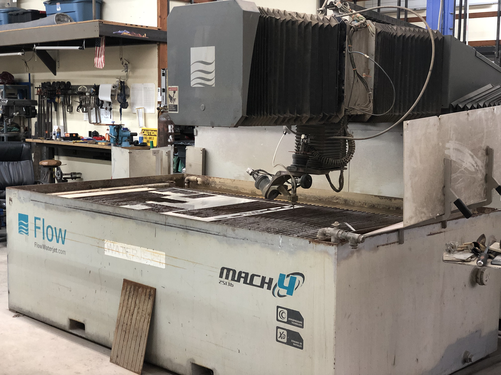
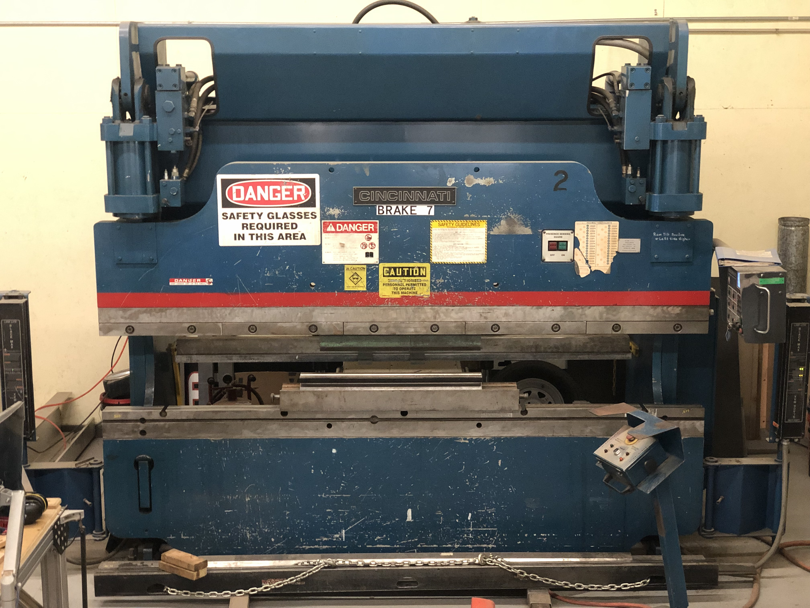

import { Link } from "gatsby"
import MdxWrapper from "../../components/mdx-wrapper"
import Seo from "../../components/seo"

# Rapid Prototyping

JKV specializes in rapid prototyping of products in smaller quantities. 

Do you already have a design and need someone to simply make-to-print, quickly? Do you need us to help with finishing out your design, then build it? We have helped many clients in either situations.

Of course we are also capable of fully engineering a product, and build it right here in our shop.

<h1 id="equipment">Fabrication Equipment and Capabilities</h1>

- CNC Waterjet cutting on our Flow Mach IV (5'x8' capacity) - Steel, Stainless Steel, Aluminum, Plastics, Composites, Stone, etc.
- CNC machining on 2 routers (wood, plastic, composites, and aluminum)
- CNC Press-Brake Sheetmetal Bending (up to 10' length and 1/2" thickness)
- CNC Tube Bending (0.5" to 2.0" steel tubing up to schedule 40 wall thickness)
- Welding (TIG, AC/DC-Pulse MIG, Stick)

<h1 id="examples">Examples of Work</h1>

Here are some of our most recent work:

No matter how simple or complex, we love helping our clients through high quality fabrication work.

# Contact Us

Let us know how we can help with your next project.

  <Link to="/contact#contact-form" className="btn btn-yellow">Contact Us</Link>

export const Head = () => <Seo title="Fabrication Services"/>
export default ({children}) => <MdxWrapper title="Fabrication Services">{children}</MdxWrapper>